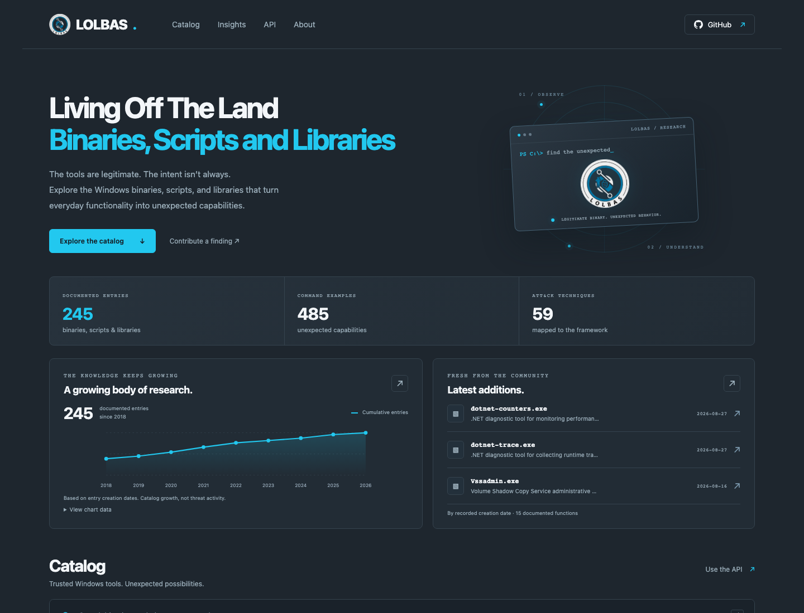

# LOLBAS UI

A fast, independently hosted Astro interface for the community-maintained
[LOLBAS catalog](https://github.com/LOLBAS-Project/LOLBAS). Search, combine filters,
sort by recently added or any catalog column, explore catalog growth, and open
complete command/reference pages. The original LOLBAS project remains the source
of truth for every entry.

This repository owns **the UI and its build/hosting automation**. It contains no
editable catalog mirror, backend, or committed YAML collection. Catalog changes
and research contributions belong [upstream](https://github.com/LOLBAS-Project/LOLBAS/blob/master/CONTRIBUTING.md);
UI issues and improvements belong here.



## Run locally

Node 22.22.0; no deployment token is needed to read the public upstream catalog.

```sh
cd website
npm ci
npm run sync:upstream
npm run dev
```

`sync:upstream` discovers upstream's default branch (currently `master`) and
checks out its exact SHA under ignored `.upstream/`. To inspect an older snapshot,
run `node ../scripts/sync-local.mjs <full-upstream-SHA>`. An existing local source
checkout can be supplied with `LOLBAS_SOURCE_DIR=/absolute/path/to/yml`.
Refresh the snapshot before a new development session; `prepare:data` deliberately
does not fetch over the network so a build cannot change its input mid-run.

## Verification

```sh
cd website
npm run format:check
npm run check
npm run test:data
node --test ../scripts/*.test.mjs
npm run build
npx playwright install chromium
npm test
SITE_BASE=/lolbas-ui npm run build
SITE_BASE=/lolbas-ui npm test
SITE_URL=https://lolbas.io SITE_BASE=/ npm run build
SITE_URL=https://lolbas.io SITE_BASE=/ npm test
```

Tests cover source validation, URLs and filesystem boundaries, API compatibility,
sync/no-op/failure/rollback decisions, publication permissions, browser search,
filters, sorting, copying, mobile/no-JS rendering, and project/custom-domain paths.
Never execute the catalog's example commands.

## Automatic upstream updates

[Publish independent LOLBAS UI](.github/workflows/publish.yml) runs on UI `main`
pushes, manual dispatch, and a scheduled check every five minutes. It reads public
GitHub merge events and resolves the upstream default branch's latest commit.
The branch SHA is authoritative because the event feed can lag or omit events.
Squash/rebase merges and direct default-branch pushes are covered as well.
Several merges between checks can be included in one rebuild of the latest state.

It compares the upstream SHA, UI SHA, and effective site URL/base with the last
successful deployment. No change means **no install, build or deployment**. New
content is fetched at one immutable commit, validated and rendered by our own
code; upstream scripts and workflows are never executed. Invalid/unreadable
source or state fails the job and leaves the current site available.

The entire resolve/build/deploy/state sequence is serialized. Full root browser
tests, prefixed-path tests, and the final configured site's smoke test gate the
artifact. Pages publishes that exact same-run artifact. Only after a successful
deployment does a separate job advance `deployment-state/deployment.json`. That
branch contains metadata only; source data is never pushed here. Failed builds or
deployments don't acknowledge the upstream SHA and will be retried next check.
The output's `build-info.json`, `source-revision.txt` and `upstream-revision.txt`
identify both inputs. Detail pages link to the exact upstream source commit,
including during a rollback hold; contribution links use its default branch.

GitHub schedules are best effort: they can be delayed, dropped under load, or
automatically disabled after 60 days of repository inactivity once public.
Monitor Actions and the served `build-info.json`; re-enable the workflow if
GitHub disables it. A manual dispatch always checks for updates. For truly
immediate merge notifications, upstream maintainers would need to configure a
webhook/GitHub App or an external scheduler could dispatch this workflow; this
repo does not claim to receive another repository's native push event.

## Hosting and custom domain

Initial configuration is GitHub Pages at
`https://magicsword-io.github.io/lolbas-ui/`. Pages must be available for the repo's
visibility/organization plan. Publication remains off until the repository
variable `PAGES_ENABLED` is the literal `true`; read-only CI works regardless.

1. Enable Pages with **GitHub Actions** as the source. Restrict the `github-pages`
   environment to `main` and retain desired reviewer controls.
2. Set repository variable `PAGES_ENABLED=true`, then dispatch the publish workflow
   with `force=true` for the first release. No PAT/deploy key is required.
3. Check the deployed UI, `build-info.json`, and successful state-recording job.

For a future domain such as `lolbas.io`, first obtain/control the domain and follow
[GitHub's domain/DNS setup](https://docs.github.com/en/pages/configuring-a-custom-domain-for-your-github-pages-site).
Then set **both** repository variables:

```text
SITE_URL=https://lolbas.io
SITE_BASE=/
```

Configure the same custom domain in Pages settings and enable HTTPS once DNS and
certificate issuance finish. Dispatch a publish run. A configuration change alone
causes a rebuild on the next check, even if both source SHAs are unchanged. UI
canonical links/API examples use the configured host; generated compatibility
exports keep official upstream URLs. Never point DNS at an unconfigured Pages site.

## Rollback and recovery

In the publish workflow's manual form, provide a verified full upstream commit
SHA in `upstream_revision`. This publishes a tested snapshot and records a durable
**hold**: scheduled checks and UI updates continue using that snapshot. Dispatch
with `resume=true` to clear the hold and follow current upstream HEAD again.
Don't supply a pinned SHA and resume together. `force=true` rebuilds the current
selected snapshot without changing hold status. To roll back UI code, revert
the UI commit on `main`; that pushes a new tested build from the selected source.

Disable publication with `PAGES_ENABLED=false` when diagnosing a failure. Existing
Pages output stays live. Avoid hand-editing deployment state: corrupt/unreadable
state stops publication instead of being treated as a fresh install. If Pages
deployed but state recording failed, repair the job's repository permission and
choose **Re-run all jobs** (not only failed jobs), or make a fresh manual dispatch.
Artifacts are namespaced by run attempt, so a failed-job-only rerun cannot find
artifacts from its earlier successful jobs. If recovering a pinned rollback,
repeat its upstream SHA: the hold is durable only after state recording succeeds.
The next successful normal check may safely rebuild the same snapshot.

## Attribution and compatibility

LOLBAS content, badge and favicon come from the
[LOLBAS Project](https://github.com/LOLBAS-Project/LOLBAS); original logos are credited
to Adam Nadrowski. This is an independent interface and is not the official LOLBAS
site. Upstream maintainers and contribution links are identified accordingly.
GPL-3.0 applies; retain [LICENSE](LICENSE), [upstream notice](NOTICE.md), and deployed
license/attribution files. GitHub Octicons' MIT notice also ships with the site.

Existing detail paths/anchors, JSON fields, 17 CSV columns, Navigator layer, and
count badge remain available as generated, read-only exports. Chart dates reflect
YAML `Created` values: catalog growth, not observed threat activity.
